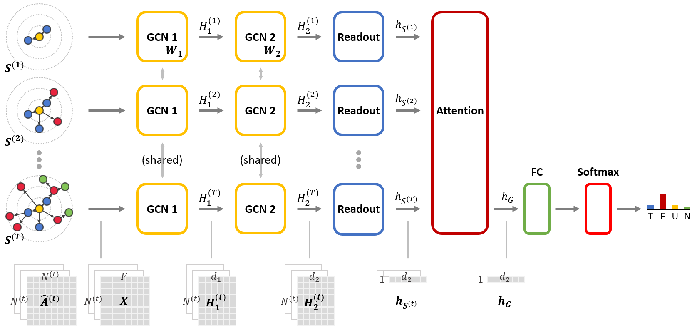

# Dynamic GCN for Rumor Detection


This repository is a PyTorch implementation of "Dynamic Graph Convolutional Networks with Attention Mechanism for Rumor Detection on Social Media" which is submitted to PLOS ONE.

<!--
### Overview

-->


### Project Structure

``` markdown
├── README.md
├── resources
│   ├── Twitter15_label_All.txt
│   ├── Twitter16_label_All.txt
│   └── Weibo_label_All.txt
├── scripts
│   ├── prepare_dataset.sh
│   └── run.sh
├── dynamic-gcn (src)
│   ├── preparation
│   │   ├── preprocess_dataset.py
│   │   └── prepare_snapshots.py
│   ├── tools
│   │   ├── random_folds.py
│   │   ├── early_stopping.py
│   │   └── evaluation.py
│   ├── project_setting.py
│   ├── main.py
│   ├── dataset.py
│   ├── models.py
│   └── utils.py
└── baselines
    ├── GRU
    ├── RvNN
    ├── BiGCN
    └── ...

```


### Requirements
* Python 3.8
* CUDA 10.2
* PyTorch 1.7.1
* PyTorch Geometric 1.6
    + torch-scatter 2.0.5
    + torch-sparse 0.6.8


### Setup
```bash
$ sudo apt-get install python3-venv
$ cd ./dynamic-gcn-public
$ python3 -m venv env
$ source ./env/bin/activate

(env) pip install --upgrade pip
(env) pip install numpy  # for torch
(env) pip install scipy  # for torch-sparse


# Titan, RTX 20X0 -> CUDA 10.2
# (env) pip install torch

# RTX 30X0 -> CUDA 11.0 -> (https://pytorch.org/get-started/locally/)
(env) pip install torch==1.7.1+cu110 torchvision==0.8.2+cu110 torchaudio===0.7.2 -f https://download.pytorch.org/whl/torch_stable.html

(env) python -c "import torch; print(torch.__version__)"
(env) python -c "import torch; print(torch.version.cuda)"
(env) TORCH=1.7.0  # 1.7.1
(env) CUDA=cu110

(env) pip install --no-index torch-scatter -f https://pytorch-geometric.com/whl/torch-${TORCH}+${CUDA}.html
(env) pip install --no-index torch-sparse -f https://pytorch-geometric.com/whl/torch-${TORCH}+${CUDA}.html
(env) pip install torch-geometric
```

### Datasets

The datasets used in the experiments were based on the three publicly available datasets released by Ma et al. (2017).
Detailed information of the datasets can be found in the [LINK](https://github.com/majingCUHK/Rumor_RvNN).


### Usage
``` bash
# check requirements
(env) python ./dynamic-gcn/project_setting.py

# prepare dataset
(env) sh ./scripts/prepare_dataset.sh

# preprocess
(env) python ./dynamic-gcn/preparation/preprocess_dataset.py Twitter16 3
(env) python ./dynamic-gcn/preparation/prepare_snapshots.py Twitter16 sequential 3

# model
(env) python ./dynamic-gcn/main.py --model GCN --learning-sequence additive \
    --dataset-name Twitter16 --dataset-type sequential --snapshot-num 3 \
    --cuda cuda:1

```


### References
- [PyTorch Geometric](https://github.com/rusty1s/pytorch_geometric)
- [Rumor Detection - RvNN](https://github.com/majingCUHK/Rumor_RvNN)
- [Rumor Detection - BiGCN](https://github.com/TianBian95/BiGCN)
